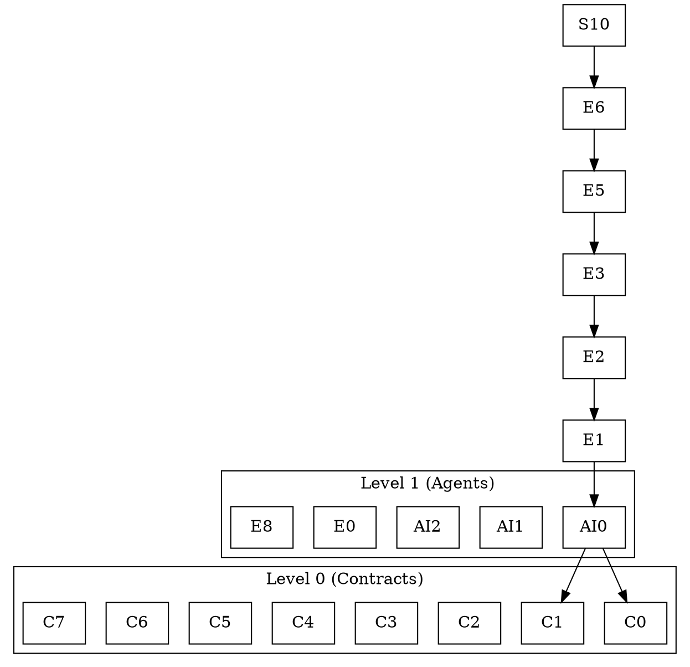

# FORGE — Dependency Graph Specification

## 1. OVERVIEW

FORGE maintains **two independent dependency graphs** that must both be cycle-free:

| Graph | Domain | Governs | Validated By |
|-------|--------|---------|--------------|
| **Graph A** | Pipeline Modules (Python) | Build order of FORGE platform code | `tests/test_dependency_graph.py` |
| **Graph B** | UBT Modules (C++) | Compile order of generated UE5 projects | `ai/architect_agent.py` + `engine/build_runner.py` |

---

## 2. GRAPH A — PIPELINE MODULE DEPENDENCIES

### 2.1 Complete Node List

| Node ID | Module Path | Type | Level |
|---------|-------------|------|-------|
| `C0` | `contracts/models/game_brief.py` | Pydantic Schema | L0 |
| `C1` | `contracts/models/project_spec.py` | Pydantic Schema | L0 |
| `C2` | `contracts/models/code_artifact.py` | Pydantic Schema | L0 |
| `C3` | `contracts/models/build_result.py` | Pydantic Schema | L0 |
| `C4` | `contracts/models/agent_message.py` | Pydantic Schema | L0 |
| `C5` | `contracts/models/platform_spec.py` | Pydantic Schema | L0 |
| `C6` | `contracts/models/store_spec.py` | Pydantic Schema | L0 |
| `C7` | `contracts/api.yaml` | OpenAPI Spec | L0 |
| `C8` | `templates/interfaces/IForgeGameMode.h` | UE5 Header | L0 |
| `C9` | `templates/interfaces/IForgeCharacter.h` | UE5 Header | L0 |
| `C10` | `templates/interfaces/IForgeGameInstance.h` | UE5 Header | L0 |
| `C11` | `templates/interfaces/IForgeInventory.h` | UE5 Header | L0 |
| `C12` | `templates/interfaces/IForgeSaveGame.h` | UE5 Header | L0 |
| `C13` | `templates/interfaces/IForgeUIManager.h` | UE5 Header | L0 |
| `C14` | `templates/interfaces/IForgeAudioManager.h` | UE5 Header | L0 |
| `C15` | `templates/interfaces/IForgeAchievement.h` | UE5 Header | L0 |
| `C16` | `templates/interfaces/IForgePlatformLayer.h` | UE5 Header | L0 |
| `C17` | `templates/interfaces/IForgeOnlineSubsystem.h` | UE5 Header | L0 |
| `AI0` | `ai/architect_agent.py` | Agent | L1 |
| `AI1` | `ai/test_agent.py` | Agent | L1 |
| `AI2` | `ai/repair_loop.py` | Agent | L1 |
| `AI3` | `ai/test_generation/cpp_test_generator.py` | Test Generator | L2 |
| `AI4` | `ai/test_generation/blueprint_test_validator.py` | Test Generator | L2 |
| `AI5` | `ai/test_generation/test_harness.py` | Test Generator | L2 |
| `E0` | `engine/ue5_scanner.py` | Engine Module | L1 |
| `E1` | `engine/brief_parser.py` | Engine Module | L2 |
| `E2` | `engine/project_scaffolder.py` | Engine Module | L3 |
| `E3` | `engine/cpp_generator.py` | Engine Module | L4 |
| `E4` | `engine/blueprint_generator.py` | Engine Module | L4 |
| `E5` | `engine/build_runner.py` | Engine Module | L5 |
| `E6` | `engine/package_agent.py` | Engine Module | L6 |
| `E7` | `engine/store_agent.py` | Engine Module | L6 |
| `E8` | `engine/learning_store.py` | Engine Module | L1 |
| `E9` | `engine/platform_guards.py` | Engine Module | L4 |
| `S0` | `server/api/projects.py` | API Endpoint | L7 |
| `S1` | `server/api/architecture.py` | API Endpoint | L7 |
| `S2` | `server/api/generation.py` | API Endpoint | L7 |
| `S3` | `server/api/builds.py` | API Endpoint | L7 |
| `S4` | `server/api/packages.py` | API Endpoint | L7 |
| `S5` | `server/api/store.py` | API Endpoint | L7 |
| `S6` | `server/api/auth.py` | API Endpoint | L7 |
| `S7` | `server/workers/generation_worker.py` | Celery Worker | L7 |
| `S8` | `server/workers/build_worker.py` | Celery Worker | L7 |
| `S9` | `server/workers/package_worker.py` | Celery Worker | L7 |
| `S10` | `server/main.py` | Server Entry | L8 |
| `D0` | `dashboard/src/pages/ProjectBrief.jsx` | Dashboard Page | L7 |
| `D1` | `dashboard/src/pages/GenerationProgress.jsx` | Dashboard Page | L7 |
| `D2` | `dashboard/src/pages/FileTree.jsx` | Dashboard Page | L7 |
| `D3` | `dashboard/src/pages/BuildConsole.jsx` | Dashboard Page | L7 |
| `D4` | `dashboard/src/pages/PlatformPackages.jsx` | Dashboard Page | L7 |
| `D5` | `dashboard/src/pages/LearningStore.jsx` | Dashboard Page | L7 |

### 2.2 Edge List (Directed Dependencies)

```
# Level 0 — No dependencies (foundation)
C0, C1, C2, C3, C4, C5, C6, C7, C8-C17: []

# Level 1 — Depends on L0 only
AI0 → [C0, C1, C8-C17]          # architect_agent needs contracts + interfaces
AI1 → [C0, C3]                  # test_agent needs game_brief + build_result
AI2 → [C0, C3]                  # repair_loop needs game_brief + build_result
E0 → [C0]                       # ue5_scanner needs game_brief
E8 → [C0, C1]                   # learning_store needs game_brief + project_spec

# Level 2 — Depends on L0 + L1
AI3 → [C0, C1, AI1]             # cpp_test_generator needs contracts + test_agent
AI4 → [C0, C1, AI1]             # blueprint_test_validator needs contracts + test_agent
AI5 → [C0, C1, AI1]             # test_harness needs contracts + test_agent
E1 → [C0, C1, AI0]              # brief_parser needs contracts + architect_agent

# Level 3 — Depends on L0-L2
E2 → [C0, C1, C8-C17, E1]       # project_scaffolder needs contracts + interfaces + brief_parser

# Level 4 — Depends on L0-L3
E3 → [C0-C2, C8-C17, E2]        # cpp_generator needs contracts + interfaces + scaffolder
E4 → [C0, C1, E2]               # blueprint_generator needs contracts + scaffolder
E9 → [C0, C5]                   # platform_guards needs contracts + platform_spec

# Level 5 — Depends on L0-L4
E5 → [C0, C3, E3, AI1]          # build_runner needs contracts + cpp_generator + test_agent

# Level 6 — Depends on L0-L5
E6 → [C0, C5, E5]               # package_agent needs contracts + platform_spec + build_runner
E7 → [C0, C6, E6]               # store_agent needs contracts + store_spec + package_agent

# Level 7 — Depends on L0-L6 (parallel: api + workers + dashboard)
S0 → [C0, C1, C7, E1, E2]       # projects API needs contracts + api.yaml + parsers
S1 → [C0, C1, C7, AI0]          # architecture API needs contracts + api.yaml + architect
S2 → [C0, C1, C7, E3, E4, E5]   # generation API needs contracts + generators + build_runner
S3 → [C0, C3, C7, E5]           # builds API needs contracts + build_result + build_runner
S4 → [C0, C5, C7, E6]           # packages API needs contracts + platform_spec + package_agent
S5 → [C0, C6, C7, E7]           # store API needs contracts + store_spec + store_agent
S6 → [C0, C7]                   # auth API needs contracts + api.yaml
S7 → [C0, C1, E1, E2, E3, E4]   # generation_worker needs contracts + all generators
S8 → [C0, C3, E5]               # build_worker needs contracts + build_runner
S9 → [C0, C5, E6]               # package_worker needs contracts + package_agent
D0 → [C0, C7]                   # ProjectBrief needs contracts + api.yaml
D1 → [C0, C7]                   # GenerationProgress needs contracts + api.yaml
D2 → [C0, C7]                   # FileTree needs contracts + api.yaml
D3 → [C0, C7]                   # BuildConsole needs contracts + api.yaml
D4 → [C0, C7]                   # PlatformPackages needs contracts + api.yaml
D5 → [C0, C7]                   # LearningStore needs contracts + api.yaml

# Level 8 — Depends on all L7
S10 → [S0, S1, S2, S3, S4, S5, S6, S7, S8, S9]  # main.py imports all APIs + workers
```

### 2.3 Adjacency List Representation

```python
GRAPH_A = {
    # L0 — Foundation (no outgoing edges)
    'C0': [],
    'C1': [],
    'C2': [],
    'C3': [],
    'C4': [],
    'C5': [],
    'C6': [],
    'C7': [],
    'C8': [], 'C9': [], 'C10': [], 'C11': [], 'C12': [],
    'C13': [], 'C14': [], 'C15': [], 'C16': [], 'C17': [],
    
    # L1 — Core Agents + Scanners
    'AI0': ['C0', 'C1', 'C8', 'C9', 'C10', 'C11', 'C12', 'C13', 'C14', 'C15', 'C16', 'C17'],
    'AI1': ['C0', 'C3'],
    'AI2': ['C0', 'C3'],
    'E0': ['C0'],
    'E8': ['C0', 'C1'],
    
    # L2 — Test Generation + Brief Parsing
    'AI3': ['C0', 'C1', 'AI1'],
    'AI4': ['C0', 'C1', 'AI1'],
    'AI5': ['C0', 'C1', 'AI1'],
    'E1': ['C0', 'C1', 'AI0'],
    
    # L3 — Project Scaffolding
    'E2': ['C0', 'C1', 'C8', 'C9', 'C10', 'C11', 'C12', 'C13', 'C14', 'C15', 'C16', 'C17', 'E1'],
    
    # L4 — Code Generation
    'E3': ['C0', 'C1', 'C2', 'C8', 'C9', 'C10', 'C11', 'C12', 'C13', 'C14', 'C15', 'C16', 'C17', 'E2'],
    'E4': ['C0', 'C1', 'E2'],
    'E9': ['C0', 'C5'],
    
    # L5 — Build Execution
    'E5': ['C0', 'C3', 'E3', 'AI1'],
    
    # L6 — Packaging + Store
    'E6': ['C0', 'C5', 'E5'],
    'E7': ['C0', 'C6', 'E6'],
    
    # L7 — Server + Dashboard (Parallel)
    'S0': ['C0', 'C1', 'C7', 'E1', 'E2'],
    'S1': ['C0', 'C1', 'C7', 'AI0'],
    'S2': ['C0', 'C1', 'C7', 'E3', 'E4', 'E5'],
    'S3': ['C0', 'C3', 'C7', 'E5'],
    'S4': ['C0', 'C5', 'C7', 'E6'],
    'S5': ['C0', 'C6', 'C7', 'E7'],
    'S6': ['C0', 'C7'],
    'S7': ['C0', 'C1', 'E1', 'E2', 'E3', 'E4'],
    'S8': ['C0', 'C3', 'E5'],
    'S9': ['C0', 'C5', 'E6'],
    'D0': ['C0', 'C7'],
    'D1': ['C0', 'C7'],
    'D2': ['C0', 'C7'],
    'D3': ['C0', 'C7'],
    'D4': ['C0', 'C7'],
    'D5': ['C0', 'C7'],
    
    # L8 — Server Entry Point
    'S10': ['S0', 'S1', 'S2', 'S3', 'S4', 'S5', 'S6', 'S7', 'S8', 'S9'],
}
```

### 2.4 Reverse Adjacency List (Dependents)

```python
GRAPH_A_REVERSE = {
    # L0 nodes — everything depends on these
    'C0': ['AI0', 'AI1', 'AI2', 'AI3', 'AI4', 'AI5', 'E0', 'E1', 'E2', 'E3', 'E4', 'E5', 'E6', 'E7', 'E8', 'E9', 'S0', 'S1', 'S2', 'S3', 'S4', 'S5', 'S6', 'S7', 'S8', 'S9', 'D0', 'D1', 'D2', 'D3', 'D4', 'D5'],
    'C1': ['AI0', 'AI3', 'AI4', 'AI5', 'E1', 'E2', 'E3', 'E4', 'E8', 'S0', 'S1', 'S2', 'S7'],
    'C7': ['S0', 'S1', 'S2', 'S3', 'S4', 'S5', 'S6', 'D0', 'D1', 'D2', 'D3', 'D4', 'D5'],
    # ... (truncated for brevity)
}
```

---

## 3. GRAPH B — UBT MODULE DEPENDENCIES (Generated per Project)

### 3.1 Standard Module Graph Template

```
┌─────────────────────────────────────────────────────────────────────┐
│                    GENERATED PROJECT MODULE GRAPH                   │
└─────────────────────────────────────────────────────────────────────┘

    {Project}Core.Build.cs
           │
           │ (no UE5 game module deps)
           ▼
    {Project}GameFramework.Build.cs
           │
           │ deps: {Project}Core
           ▼
    {Project}[Genre]Systems.Build.cs
           │
           │ deps: {Project}Core, {Project}GameFramework
           ▼
    {Project}UI.Build.cs
           │
           │ deps: {Project}Core, {Project}GameFramework, {Project}[Genre]Systems
           ▼
    {Project}Platform.Build.cs
           │
           │ deps: All above modules
           ▼
    [Output: Packaged Game]
```

### 3.2 Module Graph by Genre

#### Action/RPG Project
```python
GRAPH_B_ACTION_RPG = {
    'MyGameCore': [],
    'MyGameGameFramework': ['MyGameCore'],
    'MyGameCombatSystem': ['MyGameCore', 'MyGameGameFramework'],
    'MyGameAbilitySystem': ['MyGameCore', 'MyGameGameFramework', 'MyGameCombatSystem'],
    'MyGameUI': ['MyGameCore', 'MyGameGameFramework', 'MyGameCombatSystem', 'MyGameAbilitySystem'],
    'MyGamePlatform': ['MyGameCore', 'MyGameGameFramework', 'MyGameCombatSystem', 'MyGameAbilitySystem', 'MyGameUI'],
}
```

#### Open World Project
```python
GRAPH_B_OPEN_WORLD = {
    'MyGameCore': [],
    'MyGameGameFramework': ['MyGameCore'],
    'MyGameWorldStreaming': ['MyGameCore', 'MyGameGameFramework'],
    'MyGameTerrainSystem': ['MyGameCore', 'MyGameGameFramework', 'MyGameWorldStreaming'],
    'MyGameUI': ['MyGameCore', 'MyGameGameFramework', 'MyGameWorldStreaming', 'MyGameTerrainSystem'],
    'MyGamePlatform': ['MyGameCore', 'MyGameGameFramework', 'MyGameWorldStreaming', 'MyGameTerrainSystem', 'MyGameUI'],
}
```

#### Multiplayer Project
```python
GRAPH_B_MULTIPLAYER = {
    'MyGameCore': [],
    'MyGameGameFramework': ['MyGameCore'],
    'MyGameNetworkSystem': ['MyGameCore', 'MyGameGameFramework'],
    'MyGameReplication': ['MyGameCore', 'MyGameGameFramework', 'MyGameNetworkSystem'],
    'MyGameUI': ['MyGameCore', 'MyGameGameFramework', 'MyGameNetworkSystem', 'MyGameReplication'],
    'MyGamePlatform': ['MyGameCore', 'MyGameGameFramework', 'MyGameNetworkSystem', 'MyGameReplication', 'MyGameUI'],
}
```

#### Mobile Puzzle Project
```python
GRAPH_B_MOBILE_PUZZLE = {
    'MyGameCore': [],
    'MyGameGameFramework': ['MyGameCore'],
    'MyGamePuzzleSystem': ['MyGameCore', 'MyGameGameFramework'],
    'MyGameUI': ['MyGameCore', 'MyGameGameFramework', 'MyGamePuzzleSystem'],
    'MyGamePlatform': ['MyGameCore', 'MyGameGameFramework', 'MyGamePuzzleSystem', 'MyGameUI'],
}
```

### 3.3 Module Specification Schema

```python
class ModuleSpec(BaseModel):
    """Generated by architect_agent for each project."""
    module_name: str
    module_type: Literal['Core', 'GameFramework', 'GenreSystem', 'UI', 'Platform']
    dependencies: List[str]  # Other module names
    public_include_paths: List[str]
    private_include_paths: List[str]
    dependency_modules: List[str]  # UE5 modules (Engine, CoreUObject, etc.)
    b_force_compile: bool = False
    platform_guards: List[str] = []  # ['PS5', 'XBOX', etc.]
```

---

## 4. CYCLE DETECTION ALGORITHMS

### 4.1 DFS-Based Cycle Detection (Graph A)

```python
from typing import Dict, List, Tuple, Set
from enum import Enum

class Color(Enum):
    WHITE = 0  # Not visited
    GRAY = 1   # Currently visiting (in recursion stack)
    BLACK = 2  # Completely visited

def detect_cycles_dfs(graph: Dict[str, List[str]]) -> Tuple[bool, List[List[str]]]:
    """
    Detect cycles in directed graph using DFS.
    
    Returns:
        Tuple of (has_cycle, list_of_cycles)
    """
    color: Dict[str, Color] = {node: Color.WHITE for node in graph}
    parent: Dict[str, str] = {node: None for node in graph}
    cycles: List[List[str]] = []
    
    def dfs(node: str, path: List[str]) -> None:
        color[node] = Color.GRAY
        
        for neighbor in graph.get(node, []):
            if neighbor not in color:
                # Node doesn't exist in graph — skip
                continue
                
            if color[neighbor] == Color.GRAY:
                # Back edge found — cycle detected
                cycle_start_idx = path.index(neighbor)
                cycle = path[cycle_start_idx:] + [neighbor]
                cycles.append(cycle)
            elif color[neighbor] == Color.WHITE:
                parent[neighbor] = node
                dfs(neighbor, path + [neighbor])
        
        color[node] = Color.BLACK
    
    for node in graph:
        if color[node] == Color.WHITE:
            dfs(node, [node])
    
    return (len(cycles) > 0, cycles)
```

### 4.2 Kahn's Algorithm for Topological Sort + Cycle Detection

```python
from collections import deque, defaultdict

def topological_sort_kahn(graph: Dict[str, List[str]]) -> Tuple[List[str], bool, List[str]]:
    """
    Perform topological sort using Kahn's algorithm.
    Also detects cycles.
    
    Returns:
        Tuple of (sorted_nodes, has_cycle, nodes_in_cycle)
    """
    # Calculate in-degrees
    in_degree: Dict[str, int] = defaultdict(int)
    for node in graph:
        if node not in in_degree:
            in_degree[node] = 0
        for neighbor in graph[node]:
            in_degree[neighbor] += 1
    
    # Initialize queue with nodes having in-degree 0
    queue = deque([node for node in graph if in_degree[node] == 0])
    result: List[str] = []
    
    while queue:
        node = queue.popleft()
        result.append(node)
        
        for neighbor in graph.get(node, []):
            in_degree[neighbor] -= 1
            if in_degree[neighbor] == 0:
                queue.append(neighbor)
    
    # Check for cycle
    has_cycle = len(result) != len(graph)
    nodes_in_cycle = [node for node in graph if node not in result]
    
    return (result, has_cycle, nodes_in_cycle)
```

### 4.3 Tarjan's Strongly Connected Components

```python
def tarjan_scc(graph: Dict[str, List[str]]) -> List[List[str]]:
    """
    Find all strongly connected components using Tarjan's algorithm.
    SCCs with more than one node indicate cycles.
    """
    index_counter = [0]
    stack: List[str] = []
    lowlink: Dict[str, int] = {}
    index: Dict[str, int] = {}
    on_stack: Dict[str, bool] = {}
    sccs: List[List[str]] = []
    
    def strongconnect(node: str) -> None:
        index[node] = index_counter[0]
        lowlink[node] = index_counter[0]
        index_counter[0] += 1
        stack.append(node)
        on_stack[node] = True
        
        for neighbor in graph.get(node, []):
            if neighbor not in index:
                strongconnect(neighbor)
                lowlink[node] = min(lowlink[node], lowlink[neighbor])
            elif on_stack.get(neighbor, False):
                lowlink[node] = min(lowlink[node], index[neighbor])
        
        # Root of SCC
        if lowlink[node] == index[node]:
            scc: List[str] = []
            while True:
                w = stack.pop()
                on_stack[w] = False
                scc.append(w)
                if w == node:
                    break
            sccs.append(scc)
    
    for node in graph:
        if node not in index:
            strongconnect(node)
    
    return sccs
```

---

## 5. TOPOLOGICAL LEVEL ASSIGNMENT

### 5.1 Level Assignment Algorithm

```python
def assign_topological_levels(graph: Dict[str, List[str]]) -> Dict[str, int]:
    """
    Assign each node to its topological level.
    Level 0 = nodes with no dependencies.
    Level N = max(level of dependencies) + 1.
    """
    levels: Dict[str, int] = {}
    
    def get_level(node: str, visited: Set[str]) -> int:
        if node in levels:
            return levels[node]
        
        if node in visited:
            raise ValueError(f"Cycle detected at node: {node}")
        
        visited.add(node)
        
        deps = graph.get(node, [])
        if not deps:
            levels[node] = 0
        else:
            max_dep_level = max(get_level(dep, visited) for dep in deps if dep in graph)
            levels[node] = max_dep_level + 1
        
        visited.remove(node)
        return levels[node]
    
    for node in graph:
        get_level(node, set())
    
    return levels
```

### 5.2 Computed Levels for Graph A

| Level | Nodes | Count |
|-------|-------|-------|
| L0 | C0, C1, C2, C3, C4, C5, C6, C7, C8-C17 | 26 |
| L1 | AI0, AI1, AI2, E0, E8 | 5 |
| L2 | AI3, AI4, AI5, E1 | 4 |
| L3 | E2 | 1 |
| L4 | E3, E4, E9 | 3 |
| L5 | E5 | 1 |
| L6 | E6, E7 | 2 |
| L7 | S0, S1, S2, S3, S4, S5, S6, S7, S8, S9, D0, D1, D2, D3, D4, D5 | 16 |
| L8 | S10 | 1 |
| **Total** | | **59** |

### 5.3 Level Visualization

```
Level 0 (26 nodes)
├── C0-C7 (8 contract files)
└── C8-C17 (10 interface headers)

Level 1 (5 nodes)
├── AI0 (architect_agent)
├── AI1 (test_agent)
├── AI2 (repair_loop)
├── E0 (ue5_scanner)
└── E8 (learning_store)

Level 2 (4 nodes)
├── AI3-AI5 (test_generation/)
└── E1 (brief_parser)

Level 3 (1 node)
└── E2 (project_scaffolder)

Level 4 (3 nodes)
├── E3 (cpp_generator)
├── E4 (blueprint_generator)
└── E9 (platform_guards)

Level 5 (1 node)
└── E5 (build_runner)

Level 6 (2 nodes)
├── E6 (package_agent)
└── E7 (store_agent)

Level 7 (16 nodes) — MAX PARALLEL
├── S0-S6 (7 API endpoints)
├── S7-S9 (3 Celery workers)
└── D0-D5 (6 dashboard pages)

Level 8 (1 node)
└── S10 (server/main.py)
```

---

## 6. CRITICAL PATH ANALYSIS

### 6.1 Graph A Critical Path

**Definition:** Longest path from any L0 node to any L8 node.

```
Critical Path (7 hops):
C0 → AI0 → E1 → E2 → E3 → E5 → E6 → S10

Path Details:
  C0  (contracts/models/game_brief.py)
   │
   ▼
  AI0 (ai/architect_agent.py)         — brief → architecture
   │
   ▼
  E1  (engine/brief_parser.py)        — parse brief
   │
   ▼
  E2  (engine/project_scaffolder.py)  — create project structure
   │
   ▼
  E3  (engine/cpp_generator.py)       — generate C++ code
   │
   ▼
  E5  (engine/build_runner.py)        — compile project
   │
   ▼
  E6  (engine/package_agent.py)       — package binaries
   │
   ▼
  S10 (server/main.py)                — expose via API
```

**Alternative Critical Path (Test Generation):**
```
C0 → AI1 → AI3 → E5 → S10
```

### 6.2 Graph B Critical Path (Typical Project)

```
Critical Path (5 hops):
{Project}Core → {Project}GameFramework → {Project}[Genre]System → {Project}UI → {Project}Platform
```

### 6.3 Parallelization Opportunities

| Level | Parallel Count | Estimated Time | Notes |
|-------|----------------|----------------|-------|
| L0 | 26 files | ~0ms (already exist) | Immutable contracts |
| L1 | 5 files | ~2s each | Independent agents |
| L2 | 4 files | ~1s each | Can run in parallel |
| L3 | 1 file | ~500ms | No parallelization |
| L4 | 3 files | ~3s each | Can run in parallel |
| L5 | 1 file | ~200ms | No parallelization |
| L6 | 2 files | ~1s each | Can run in parallel |
| L7 | 16 files | ~500ms each | **MAX PARALLEL** |
| L8 | 1 file | ~100ms | No parallelization |

---

## 7. DEPENDENCY VALIDATION TESTS

### 7.1 Test: Graph A Cycle Detection

```python
# tests/test_dependency_graph.py
import pytest
from engine.dependency_validator import DependencyValidator

class TestGraphACycles:
    def test_no_cycles_in_pipeline_graph(self):
        validator = DependencyValidator()
        has_cycle, cycles = validator.detect_cycles(GRAPH_A)
        assert not has_cycle, f"Cycles detected: {cycles}"
    
    def test_all_nodes_reachable(self):
        validator = DependencyValidator()
        unreachable = validator.find_unreachable_nodes(GRAPH_A)
        assert len(unreachable) == 0, f"Unreachable nodes: {unreachable}"
    
    def test_topological_levels_valid(self):
        validator = DependencyValidator()
        levels = validator.assign_levels(GRAPH_A)
        
        # Verify level constraints
        for node, level in levels.items():
            for dep in GRAPH_A.get(node, []):
                assert levels[dep] < level, \
                    f"Node {node} (L{level}) depends on {dep} (L{levels[dep]})"
```

### 7.2 Test: Graph B Cycle Detection (Per Project)

```python
class TestGraphBCycles:
    def test_action_rpg_graph_valid(self):
        validator = DependencyValidator()
        has_cycle, cycles = validator.detect_cycles(GRAPH_B_ACTION_RPG)
        assert not has_cycle, f"Cycles in action/RPG graph: {cycles}"
    
    def test_open_world_graph_valid(self):
        validator = DependencyValidator()
        has_cycle, cycles = validator.detect_cycles(GRAPH_B_OPEN_WORLD)
        assert not has_cycle, f"Cycles in open world graph: {cycles}"
    
    def test_multiplayer_graph_valid(self):
        validator = DependencyValidator()
        has_cycle, cycles = validator.detect_cycles(GRAPH_B_MULTIPLAYER)
        assert not has_cycle, f"Cycles in multiplayer graph: {cycles}"
```

### 7.3 Test: Import Statement Validation

```python
class TestImportValidation:
    def test_python_imports_match_graph(self):
        """Verify actual Python imports match declared dependencies."""
        validator = DependencyValidator()
        
        for module_path, expected_deps in GRAPH_A.items():
            actual_imports = validator.extract_imports(module_path)
            
            for dep in expected_deps:
                dep_module = self.node_to_module(dep)
                assert dep_module in actual_imports or self.is_transitive(dep_module, actual_imports), \
                    f"{module_path} missing import: {dep_module}"
```

---

## 8. DEPENDENCY GRAPH PERSISTENCE

### 8.1 Graph Storage Format (JSON)

```json
{
  "graph_a": {
    "nodes": [
      {"id": "C0", "path": "contracts/models/game_brief.py", "level": 0, "type": "contract"},
      {"id": "AI0", "path": "ai/architect_agent.py", "level": 1, "type": "agent"},
      ...
    ],
    "edges": [
      {"from": "AI0", "to": "C0"},
      {"from": "AI0", "to": "C1"},
      ...
    ],
    "metadata": {
      "total_nodes": 59,
      "total_edges": 142,
      "max_level": 8,
      "critical_path_length": 7
    }
  },
  "graph_b_templates": {
    "action_rpg": {...},
    "open_world": {...},
    "multiplayer": {...},
    "mobile_puzzle": {...}
  }
}
```

### 8.2 Visualization Output (DOT Format)



---

## 9. CHANGE IMPACT ANALYSIS

### 9.1 Impact Propagation

```python
def compute_impact(graph: Dict[str, List[str]], changed_node: str) -> List[str]:
    """
    Compute all nodes affected by a change to the given node.
    Uses reverse graph traversal.
    """
    reverse_graph = build_reverse_graph(graph)
    affected = []
    visited = set()
    
    def traverse(node: str):
        if node in visited:
            return
        visited.add(node)
        affected.append(node)
        
        for dependent in reverse_graph.get(node, []):
            traverse(dependent)
    
    traverse(changed_node)
    return affected[1:]  # Exclude the changed node itself
```

### 9.2 Impact Matrix (Key Nodes)

| Changed Node | Direct Impact | Transitive Impact | Risk Level |
|--------------|---------------|-------------------|------------|
| C0 (game_brief.py) | 29 nodes | 58 nodes | **CRITICAL** |
| C1 (project_spec.py) | 13 nodes | 45 nodes | **HIGH** |
| C7 (api.yaml) | 12 nodes | 28 nodes | **HIGH** |
| AI0 (architect_agent.py) | 4 nodes | 35 nodes | MEDIUM |
| E3 (cpp_generator.py) | 2 nodes | 18 nodes | MEDIUM |
| S10 (server/main.py) | 0 nodes | 0 nodes | LOW |

---

## 10. BUILD ORDER COMPUTATION

### 10.1 Celery Task Chain Generation

```python
from celery import chain, chord, group

def build_celery_pipeline(project_id: str):
    """
    Build Celery task chain from topological levels.
    """
    levels = assign_topological_levels(GRAPH_A)
    
    # Group nodes by level
    level_groups: Dict[int, List[str]] = defaultdict(list)
    for node, level in levels.items():
        level_groups[level].append(node)
    
    # Build chain of chords
    pipeline = []
    for level in sorted(level_groups.keys()):
        nodes = level_groups[level]
        
        # Create group for this level
        level_tasks = group(
            generate_node.s(node, project_id) for node in nodes
        )
        
        # Create chord with critic gate
        level_chord = chord(
            level_tasks,
            critic_gate.s(level, project_id)
        )
        
        pipeline.append(level_chord)
    
    # Chain all levels together
    return chain(*pipeline)
```

### 10.2 Parallel Build Execution Plan

```
Execution Timeline (Graph A):

T0:    [L0: C0-C17] — Already exist (immutable)
       │
T+0ms: [L1: AI0, AI1, AI2, E0, E8] — 5 tasks parallel
       │
T+2s:  [L2: AI3, AI4, AI5, E1] — 4 tasks parallel
       │
T+3s:  [L3: E2] — 1 task
       │
T+3.5s:[L4: E3, E4, E9] — 3 tasks parallel
       │
T+6.5s:[L5: E5] — 1 task
       │
T+7s:  [L6: E6, E7] — 2 tasks parallel
       │
T+8s:  [L7: S0-S9, D0-D5] — 16 tasks parallel (MAX)
       │
T+8.5s:[L8: S10] — 1 task
       │
T+9s:  PIPELINE COMPLETE
```

---

*End of Dependency Graph Specification*
